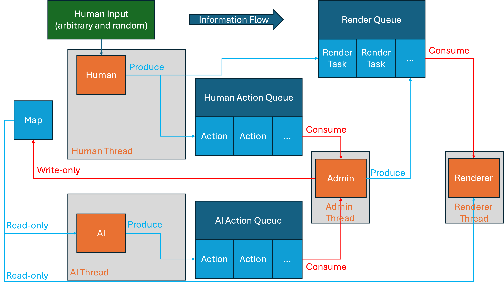

This is a C++ implementation of the game [Generals.io](https://generals.io/), developed as a group project for the course COMP2113 at the University of Hong Kong. [Code available](https://github.com/Catherine135/COMP2113GP). (It's private for the moment as required by the course, but will be made public after the course ends, which is around late December 2025.)

In this game, the player controls an army with the objective of capturing the opponent's, aka the AI's, general while defending their own. With war fog obscuring the battlefield, mountains cutting off paths, and neural strongholds getting in the way, strategic planning and balance between expansion and defense are crucial for victory. The player will have to find the enemy general while navigating the map and fighting off the enemy AI.

We implemented four types of AI players with different strategies:

- Level 1 AI (**Random Walk Strategy**):
  - **Core Principle**: Chaotic random expansion.
  - **Logic**: Identifies own tiles with movable armies and randomly selects one to move to a random valid neighbor.
  - **Behavior**: Unpredictable, often wanders within its own territory, and lacks aggression.
- Level 2 AI (**Basic Greedy Strategy**):
  - **Core Principle**: Local value-based greedy expansion with logistics supply.
  - **Logic**: Evaluates moves based on target value (Enemy Capital > Enemy City > Normal Tile). Uses BFS distance fields to flow rear armies toward the frontline. Includes anti-stagnation mechanisms to force movement.
  - **Behavior**: Distinguishes tile importance and actively supplies the frontline. More aggressive than Level 1 but lacks long-term planning.
- Level 3 AI (**Aggressive Expansion Strategy**):
  - **Core Principle**: Extreme hostility towards enemy territory, prioritizing player elimination.
  - **Logic**: Prioritizes moves in the order: Capture Enemy -> Capture Neutral -> Others. Uses efficient army control (sending `enemy_army + 1`) to conserve troops while expanding rapidly.
  - **Behavior**: Expands like a virus and attacks efficiently upon contact.
- Level 4 AI (**Advanced Strategic Strategy**):
  - **Core Principle**: Level 2 base strategy augmented with macro army assembly and periodic assaults.
  - **Logic**:
    - **Periodic Assault**: Every 100-150 turns, if the enemy capital is known, plans a direct assault path.
    - **Army Stacking**: Identifies large armies and merges them into a massive "leader" stack (Deathball) moving toward the enemy.
  - **Behavior**: Demonstrates macro strategy by building massive forces to overwhelm the player directly.

Also, to avoid dead locks in multi-threading, we designed a unidirectional information flow system:

